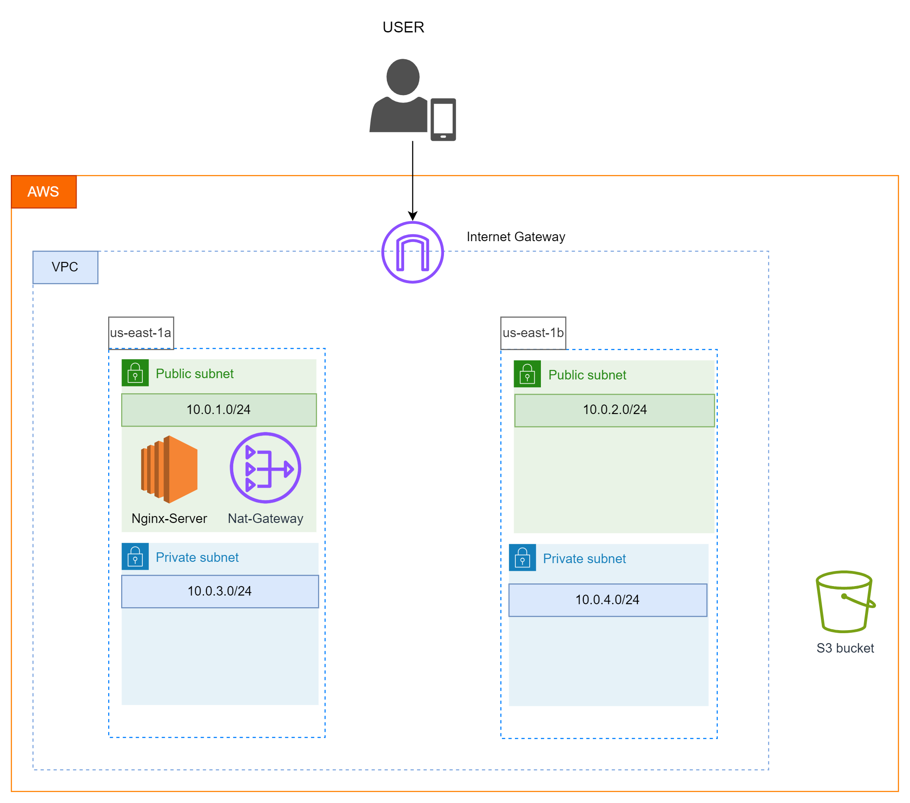
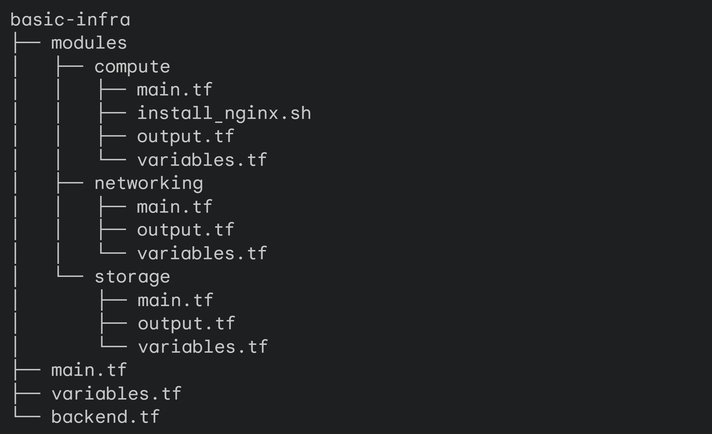

Markdown
# Basic-Infra: Scalable AWS Infrastructure with Terraform

[](infrastructure-diagram.png)

This Terraform project deploys a scalable AWS infrastructure that includes a VPC with public and private subnets, an NGINX web server, and associated networking and storage resources.

## Table of Contents

1.  [Architecture Overview](#architecture-overview)
2.  [Prerequisites](#prerequisites)
3.  [Getting Started](#getting-started)
4.  [Project Structure](#project-structure)
5.  [Modules](#modules)
    *   [VPC Module](#vpc-module)
    *   [Storage Module](#storage-module)
    *   [Compute Module](#compute-module)
6.  [Variables](#variables)
7.  [Outputs](#outputs)
8.  [State Management](#state-management)

## Architecture Overview

The infrastructure follows a modular approach, with clear separation of concerns:

*   **VPC (Networking):**
    *   Virtual Private Cloud (CIDR: 10.0.0.0/16)
    *   Public and Private Subnets (2 each)
    *   Internet Gateway for internet access
    *   NAT Gateway in the public subnet for private subnet outbound traffic
    *   Route Tables (1 public, 1 private)
    *   Security Groups (1 for the NGINX web server)
    *   Network ACLs (1 for public, 1 for private)
    *   Elastic Network Interface (ENI) in the public subnet for the web server

*   **Storage:**
    *   S3 bucket for storing Terraform state files
    *   EBS volume (20 GiB, gp2) for the NGINX web server

*   **Compute:**
    *   EC2 instance running Ubuntu 24.04
    *   Provisioned with NGINX using `user_data`

## Prerequisites

*   AWS Account: An active AWS account with sufficient permissions.
*   Terraform: Install Terraform (0.12 or later) following the official instructions: [https://learn.hashicorp.com/tutorials/terraform/install-cli](https://learn.hashicorp.com/tutorials/terraform/install-cli).
*   AWS CLI: Install and configure the AWS CLI to manage AWS resources from your terminal.

## Getting Started

1.  **Clone:** 
    ```bash
    git clone https://github.com/KaramHussain/terraformBasicInfras.git
    ```

2.  **Initialize:**
    ```bash
    cd terraformBasicInfras
    terraform init
    ```

3.  **Customize (Optional):**
    *   Modify variables in `variables.tf` to suit your environment.

4.  **Plan:**
    ```bash
    terraform plan
    ```

5.  **Apply:**
    ```bash
    terraform apply
    ```

## Project Structure
[](folderstructure.png)

## Modules

### VPC Module

*   **Resources:**
    *   `aws_vpc`: Creates the VPC.
    *   `aws_subnet` (public and private): Creates subnets in each availability zone.
    *   `aws_internet_gateway`: Enables internet access for the VPC.
    *   `aws_route_table` (public and private): Defines routing rules.
    *   `aws_route_table_association`: Associates route tables with subnets.
    *   `aws_eip`: Elastic IP for the NAT gateway.
    *   `aws_nat_gateway`: Provides outbound internet access for private subnets.
    *   `aws_security_group`: Controls traffic to and from the NGINX web server.
    *   `aws_network_acl` (public and private): Acts as a firewall at the subnet level.
    *   `aws_network_interface`: Attaches the web server to the network.

### Storage Module

*   **Resources:**
    *   `aws_ebs_volume`: Creates the EBS volume.
    *   `aws_volume_attachment`: Attaches the EBS volume to the EC2 instance.

### Compute Module

*   **Resources:**
    *   `aws_instance`: Launches the Ubuntu EC2 instance.
    *   `user_data` (install_nginx.sh): Installs and starts NGINX, creates a simple HTML page.

## Variables

*   **`region`:** AWS region (default: "us-east-1").
*   **See `variables.tf` in each module for module-specific variables.**

## Outputs

*   **See `outputs.tf` in each module for module-specific outputs.**

## State Management

Terraform state is stored remotely in an S3 bucket (`karamterraformstatefile`).

